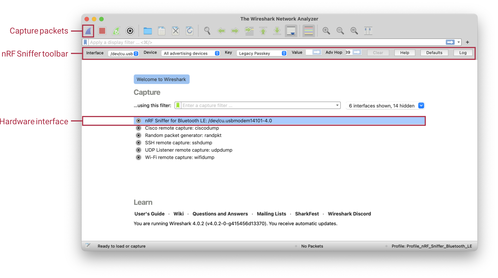

# Running the nRF Sniffer

To start sniffing, place the nRF52840 Connect Kit that runs the nRF Sniffer for Bluetooth LE firmware between the two devices that are communicating. Then open Wireshark and start recording packets.

## Setting up hardware

Connect the nRF52840 Connect Kit to your computer. Then place it between the Central and Peripheral device that you want to sniff.

## Wireshark capture setup

When you open Wireshark, the Wireshark capture screen is displayed. It includes the Wireshark interface for managing packets that are captured, the nRF Sniffer toolbar, and the hardware interfaces connected to the nRF Sniffer.

!!! tip
    If the nRF Sniffer toolbar is not visible, select __View__ > __Interface Toolbars__ > __nRF Sniffer for Bluetooth LE__.

The following options are available from the capture screen in Wireshark:

__`RSSI filter`__

:   You can apply a *RSSI* filter on the packets that are being received. Only packets that match the filter are displayed.

    You must set the capture filter in the capture screen by using the keyword `rssi`. For example, the filter `rssi >= -70` only captures packets that have an *RSSI* greater than or equal to `-70 dBm`.

    

__`Interface options`__

:   Click :fontawesome-solid-gear: next to the interface to configure additional options for the nRF Sniffer for Bluetooth LE.

    

    The following options are available:

    _`Only advertising packets`_

    :   Sniff only the advertising packets of the given device. When a new connection is established, the nRF Sniffer ignores it.

    _`Only legacy advertising packets`_

    :   Sniff only the legacy advertising packets of the given device. The nRF Sniffer does not look for the advertiser's device address in extended advertising packets in the auxiliary advertising packets.

    _`Find scan response data`_

    :   Follow scan requests and scan responses when sniffing all advertising devices. This option is useful for finding the advertiser's name in the scan response data. You need an active scanner to generate the scan requests to follow.

    _`Find auxiliary pointer data`_

    :   Follow the auxiliary pointer for additional data when sniffing all advertising devices. This option is useful for finding the advertiser's address and name in the auxiliary advertising data.

    _`Scan and follow devices on LE Coded PHY`_

    :   Sniff on the LE Coded PHY when sniffing all advertising devices and a specific device. The nRF Sniffer follows the connection on any PHY it uses. To sniff on both LE 1M PHY and LE Coded PHY at the same time, use multiple sniffers.

