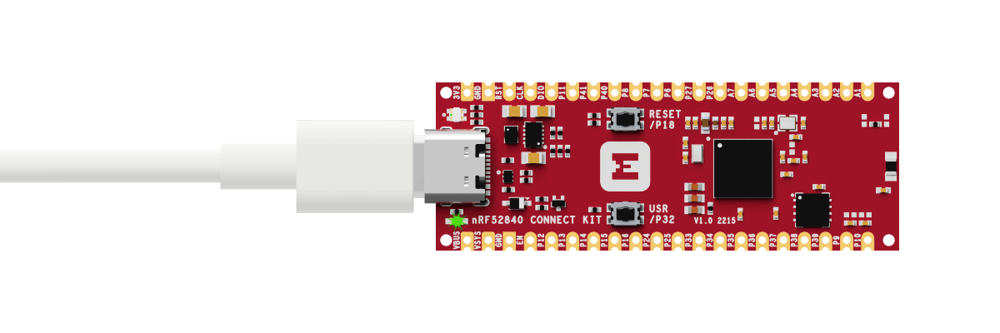

# Building and running the first sample

This guide explains how to build and run the first sample (for example, [Blinky]).

Before you start building, remember to [set up the environment](./setup.md) first.

## Build the Blinky sample

After completing the environment setup, use the following steps to build the [Blinky] sample on the command line.

1. Open a terminal window.

2. Go to `my-workspace/ncs-playground` directory created in the [Setting up the environment](./setup.md#get-the-code) section.

    ``` bash linenums="1"
    cd my-workspace/ncs-playground
    ```

3. Build the sample using the `west` command, specifying the board (following the `-b` option) as `connectkit_nrf52840`:

    ``` bash linenums="1"
    west build -p always -b connectkit_nrf52840 samples/blinky
    ```

    !!! Tip
        The `-p always` option forces a pristine build, and is recommended for new users. Users may also use the `-p auto` option, which will use heuristics to determine if a pristine build is required, such as when building another sample.

4. After running the `west build` command, the build files can be found in `build/zephyr`. 

## Flash and run the sample

The sample is designed to work with the UF2 Bootloader, so that you can easily flash the sample [using the UF2 Bootloader](../../programming/uf2boot.md). The firmware can be found in `build/zephyr` with the name `zephyr.uf2`.

To flash the firmware, complete the following steps:

1. Push and hold the __USER__ button and plug your board into the USB port of your computer. Release the __USER__ button after your board is connected. The RGB LED turns green.

2. It will mount as a Mass Storage Device called __UF2BOOT__.

3. Drag and drop `zephyr.uf2` onto the __UF2BOOT__ volume. The RGB LED blinks red fast during flashing.

4. Reset the board and the Green LED will start to blink.

    

## Next steps

Try more samples on nRF52840 Connect Kit:

* [Hello World](./samples/hello_world.md)
* [Blinky](./samples/blinky.md)
* [Button](./samples/button.md)
* [Voltage Measurement](./samples/voltage_measurement.md)
* [QSPI NOR Flash](./samples/qspi_flash.md)
* [USB HID Mouse](./samples/usb/hid_mouse.md)
* [USB Mass Storage](./samples/usb/mass.md)
* [NFC Launch App](./samples/nfc/launch_app.md)
* [NFC Text record](./samples/nfc/text_record.md)
* [NFC URI record](./samples/nfc/uri_record.md)
* [NFC Writable NDEF message](./samples/nfc/writable_ndef_msg.md)
* [BLE Beacon](./samples/ble/beacon.md)
* [BLE Observer](./samples/ble/observer.md)
* [BLE Peripheral](./samples/ble/peripheral.md)
* [BLE Peripheral LBS](./samples/ble/peripheral_lbs.md)
* [BLE Peripheral HIDS keyboard](./samples/ble/peripheral_hids_keyboard.md)
* [BLE Peripheral HIDS mouse](./samples/ble/peripheral_hids_mouse.md)
* [BLE NUS shell transport](./samples/ble/shell_bt_nus.md)
* [Thread CLI](./samples/thread/cli.md)
* [Thread CoAP](./samples/thread/coap.md)
* [Thread Co-processor](./samples/thread/coprocessor.md)
* [Zigbee Lighting](./samples/zigbee/lighting.md)
* [Zigbee NCP](./samples/zigbee/ncp.md)
* [Zigbee Shell](./samples/zigbee/shell.md)

nRF Connect SDK and Zephyr also provide a variety of application samples and demos. Documentation for those is available in:

- [Zephyr's Samples and Demos](https://docs.zephyrproject.org/latest/samples/index.html#samples-and-demos)
- [nRF Connect SDK's Samples](https://developer.nordicsemi.com/nRF_Connect_SDK/doc/latest/nrf/samples.html)
- [nRF Connect SDK's Applications](https://developer.nordicsemi.com/nRF_Connect_SDK/doc/latest/nrf/applications.html)


[Blinky]: ./samples/blinky.md