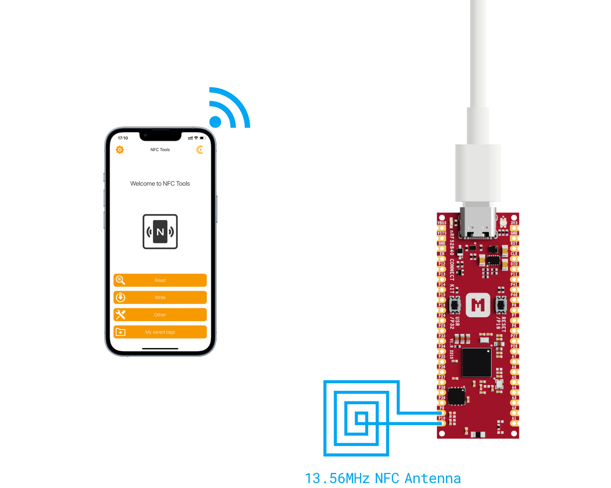

# NFC Launch App

## Overview

The NFC Launch App sample shows how to use the NFC tag to launch an app on the polling smartphone. It uses the [NFC Data Exchange Format (NDEF)] library.

When the sample starts, it initializes the NFC tag and generates an NDEF message with two records that contain the app Universal Link and Android Application Record. Then it sets up the NFC library to use the generated message and sense the external NFC field.

The only events handled by the application are the NFC events. The Green LED turns on when an NFC field is present.

## Requirements

Before you start, check that you have the required hardware and software:

- 1x [nRF52840 Connect Kit](https://makerdiary.com/products/nrf52840-connectkit)
- A 13.56MHz NFC Antenna
- 1x USB-C Cable
- A smartphone or a tablet with NFC support
- A computer running macOS, Linux, or Windows 7 or newer

## Wiring the NFC antenna



## Building the sample

Before you start building, remember to [set up the environment](../../setup.md) first.

Use the following steps to build the [NFC Launch App] sample on the command line.

1. Open a terminal window.

2. Go to `my-workspace/connect-micro-project` directory created in the [Setting up the environment](../../setup.md#get-the-code) section.

    ``` bash linenums="1"
    cd my-workspace/connect-micro-project
    ```

3. Build the sample using the `west` command, specifying the board (following the `-b` option) as `connectkit_nrf52840`:

    ``` bash linenums="1"
    west build -p always -b connectkit_nrf52840 samples/nfc/record_launch_app
    ```

    !!! Tip
        The `-p always` option forces a pristine build, and is recommended for new users. Users may also use the `-p auto` option, which will use heuristics to determine if a pristine build is required, such as when building another sample.

4. After running the `west build` command, the build files can be found in `build/zephyr`.

## Flashing the firmware

The sample is designed to work with the UF2 Bootloader, so that you can easily flash the sample [using the UF2 Bootloader](../../../../programming/uf2boot.md). The firmware can be found in `build/zephyr` with the name `zephyr.uf2`.

To flash the firmware, complete the following steps:

1. Push and hold the __USER__ button and plug your board into the USB port of your computer. Release the __USER__ button after your board is connected. The RGB LED turns green.

2. It will mount as a Mass Storage Device called __UF2BOOT__.

3. Drag and drop `zephyr.uf2` onto the __UF2BOOT__ volume. The RGB LED blinks red fast during flashing.

4. Reset the board and the sample will start running.

## Testing

After flashing the firmware to your board, complete the following steps to test it:

1. Power up nRF52840 Connect Kit by using the USB-C Cable.
2. Touch the NFC antenna with the smartphone or tablet and observe that Green LED is lit.
3. Observe that the smartphone or tablet launches the [nRF Toolbox] application.
4. Move the smartphone or tablet away from the NFC antenna and observe that Green LED turns off.

!!! Note

    Devices running iOS require the [nRF Toolbox] app to be installed before testing the sample. Devices running Android open Google Play when the application is not installed.

[NFC Data Exchange Format (NDEF)]: https://developer.nordicsemi.com/nRF_Connect_SDK/doc/latest/nrf/libraries/nfc/ndef/index.html#lib-nfc-ndef
[NFC Launch App]: https://github.com/makerdiary/connect-micro-project/tree/main/samples/nfc/record_launch_app
[nRF Toolbox]: https://www.nordicsemi.com/Software-and-Tools/Development-Tools/nRF-Toolbox