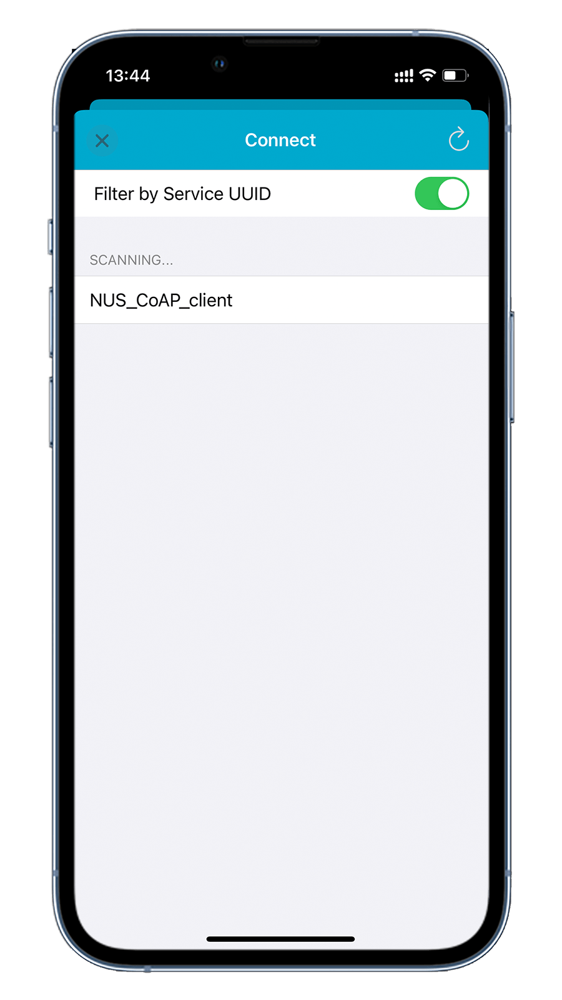
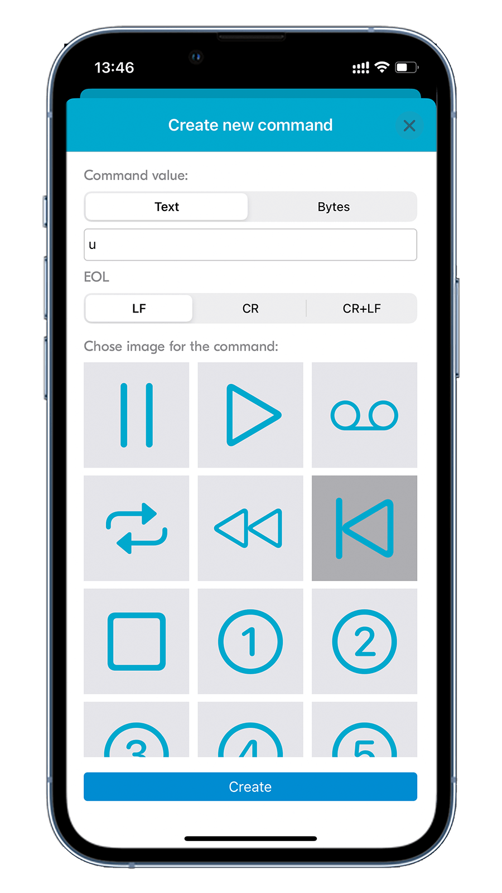

# Thread CoAP Client

## Overview

This section of the documentation explains how to set up a basic OpenThread network composed of the Thread CoAP Client and Server:

- [Thread CoAP Client] demonstrates how to use [Zephyr CoAP API] for communication to access resources available on a Thread server node. The client supports Multiprotocol Bluetooth LE extension which uses the [Nordic UART Service (NUS)] library to control the LED states over Bluetooth® LE in a Thread network.
- [Thread CoAP Server] demonstrates how to expose resources that can be accessed by other devices in the same Thread network. The following CoAP resources are exposed on the network by this sample:

    - `/light` - used to control __Green LED__
    - `/provisioning` - used to perform provisioning

After the Thread network is established, the client node can control the state of __Green LED__ on server nodes. It can turn on the LED either on every server node in the network with a multicast message, or on a single specific server node that is paired with the client node.

!!! Tip "Sniffing packets from a Thread network" 
    You can use [nRF Sniffer for 802.15.4](../../../nrf802154-sniffer/index.md) to capture and analyze packets exchanged on a Thread network.

## Requirements

Before you start, check that you have the required hardware and software:

- 2x [nRF52840 Connect Kits](https://makerdiary.com/products/nrf52840-connectkit)
- 2x USB-C Cable
- A smartphone or a tablet with [nRF Toolbox] installed
- A computer running macOS, Linux, or Windows 7 or newer

## Building the sample

Before you start building, remember to [set up the environment](../../setup.md) first.

Use the following steps to build the samples on the command line.

1. Open a terminal window.

2. Go to `my-workspace/connect-micro-project` directory created in the [Setting up the environment](../../setup.md#get-the-code) section.

    ``` bash linenums="1"
    cd my-workspace/connect-micro-project
    ```

3. Build each sample using the `west` command, specifying the board (following the `-b` option) as `connectkit_nrf52840`:

    === "Thread CoAP Client"

        ``` bash linenums="1"
        west build -p always -b connectkit_nrf52840 samples/openthread/coap_client -- -DOVERLAY_CONFIG=overlay-multiprotocol_ble.conf
        ```
    
    === "Thread CoAP Server"

        ``` bash linenums="1"
        west build -p always -b connectkit_nrf52840 samples/openthread/coap_server
        ```

    !!! Tip
        The `-p always` option forces a pristine build, and is recommended for new users. Users may also use the `-p auto` option, which will use heuristics to determine if a pristine build is required, such as when building another sample.

4. After running the `west build` command, the build files can be found in `build/zephyr`.

## Flashing the firmware

The samples are designed to work with the UF2 Bootloader, so that you can easily flash the sample [using the UF2 Bootloader](../../../../programming/uf2boot.md). The firmware can be found in `build/zephyr` with the name `zephyr.uf2`.

To flash the firmware, complete the following steps:

1. Push and hold the __USER__ button and plug your board into the USB port of your computer. Release the __USER__ button after your board is connected. The RGB LED turns green.

2. It will mount as a Mass Storage Device called __UF2BOOT__.

3. Drag and drop `zephyr.uf2` onto the __UF2BOOT__ volume. The RGB LED blinks red fast during flashing.

4. Reset the board and the sample will start running.

5. Repeat the steps above to flash the client and server board.

## Testing

After flashing the firmware to your boards, complete the following steps to test it:

1. Turn on the board that runs the [Thread CoAP Server] sample. Wait until the server's __RGB LED__ turns Green. It will create a Thread network and this node becomes the Thread network Leader.
2. Turn on the board that runs the [Thread CoAP Client] sample.
3. Wait until the client's __RGB LED__ turns Green. The client enters the network as a Child, and gradually becomes a Router.
4. Start the [nRF Toolbox] app, tap <kbd>UART</kbd> to open the UART application.
5. Connect to the device with the name __NUS_CoAP_client__ discovered in the UART application.
6. Tap the blank buttons to create new commands. The following command assignments are configured with __EOL__ set to <kbd>LF</kbd> :

    * <kbd>u</kbd> - Send a unicast CoAP message over Thread.
    * <kbd>m</kbd> - Send a multicast CoAP message over Thread.
    * <kbd>p</kbd> - Send a pairing request as CoAP message over Thread.

    { width='160' }
    { width='160' }
    { width='160' }
    { width='160' }

7. Tap the <kbd>m</kbd> command button to send a multicast `LIGHT_ON` or `LIGHT_OFF` message (alternatively) to the `/light` resource. Observe that the __Green LED__ on the server node turns on or off.

8. Pair a client with a server by completing the following steps:

    1. Press __USER__ button on a server node to enable pairing.
    2. Tap the <kbd>p</kbd> command button to pair the client with the server node in the pairing mode.

9. Tap the <kbd>u</kbd> command button to send a unicast `LIGHT_TOGGLE` message to the `/light` resource on the paired server node.

[Thread CoAP Server]: https://github.com/makerdiary/connect-micro-project/tree/main/samples/openthread/coap_server
[Thread CoAP Client]: https://github.com/makerdiary/connect-micro-project/tree/main/samples/openthread/coap_client
[Zephyr CoAP API]: https://developer.nordicsemi.com/nRF_Connect_SDK/doc/latest/zephyr/connectivity/networking/api/coap.html#coap-sock-interface
[Nordic UART Service (NUS)]: https://developer.nordicsemi.com/nRF_Connect_SDK/doc/latest/nrf/libraries/bluetooth_services/services/nus.html#nus-service-readme
[nRF Toolbox]: https://www.nordicsemi.com/Software-and-Tools/Development-Tools/nRF-Toolbox
