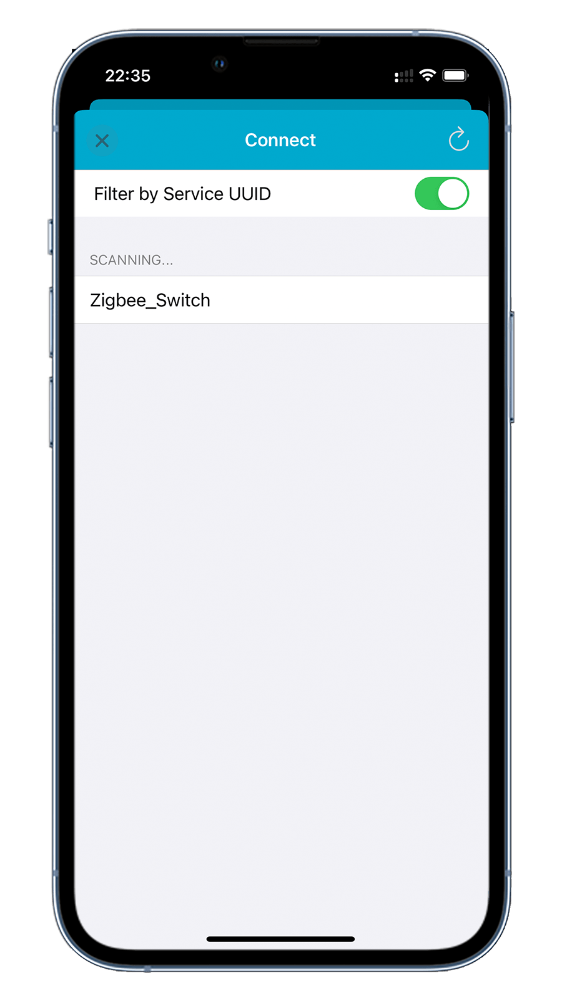

# Zigbee Lighting

## Overview

This section of the documentation explains how to set up a basic Zigbee network composed of three devices:

- [Zigbee Network coordinator] demonstrates the Zigbee Coordinator role and supports only the network steering commissioning mechanism.
- [Zigbee Light bulb] demonstrates the Zigbee Router role and implements the Dimmable Light device specification, as defined in the Zigbee Home Automation public application profile.
- [Zigbee Light switch] demonstrates the Zigbee End Device role and implements the Dimmer Switch device specification, as defined in the Zigbee Home Automation public application profile. Once commissioned into the network, it looks for devices with the implemented Level Control and On/Off clusters and can control the one that answers first. The light switch also supports Multiprotocol Bluetooth LE extension which uses the [Nordic UART Service (NUS)] library to control the light bulb states over Bluetooth® LE in a Thread network.

!!! Tip "Sniffing packets from a Zigbee network" 
    You can use [nRF Sniffer for 802.15.4](../../../nrf802154-sniffer/index.md) to capture and analyze packets exchanged on a Zigbee network.

## Requirements

Before you start, check that you have the required hardware and software:

- 3x [nRF52840 Connect Kit](https://makerdiary.com/products/nrf52840-connectkit)
- 3x USB-C Cable
- A smartphone or a tablet with [nRF Toolbox] installed
- A computer running macOS, Linux, or Windows 7 or newer

## Building the sample

Before you start building, remember to [set up the environment](../../setup.md) first.

Use the following steps to build the samples on the command line.

1. Open a terminal window.

2. Go to `my-workspace/connect-micro-project` directory created in the [Setting up the environment](../../setup.md#get-the-code) section.

    ``` bash linenums="1"
    cd my-workspace/connect-micro-project
    ```

3. Build each sample using the `west` command, specifying the board (following the `-b` option) as `connectkit_nrf52840`:

    === "Network coordinator"

        ``` bash linenums="1"
        west build -p always -b connectkit_nrf52840 samples/zigbee/network_coordinator
        ``` 

    === "Light bulb"

        ``` bash linenums="1"
        west build -p always -b connectkit_nrf52840 samples/zigbee/light_bulb
        ```
    
    === "Light switch"

        ``` bash linenums="1"
        west build -p always -b connectkit_nrf52840 samples/zigbee/light_switch
        ```  

    !!! Tip
        The `-p always` option forces a pristine build, and is recommended for new users. Users may also use the `-p auto` option, which will use heuristics to determine if a pristine build is required, such as when building another sample.

4. After running the `west build` command, the build files can be found in `build/zephyr`.

## Flashing the firmware

The samples are designed to work with the UF2 Bootloader, so that you can easily flash each sample [using the UF2 Bootloader](../../../../programming/uf2boot.md). The firmware can be found in `build/zephyr` with the name `zephyr.uf2`.

To flash the firmware, complete the following steps:

1. Push and hold the __USER__ button and plug your board into the USB port of your computer. Release the __USER__ button after your board is connected. The RGB LED turns green.

2. It will mount as a Mass Storage Device called __UF2BOOT__.

3. Drag and drop `zephyr.uf2` onto the __UF2BOOT__ volume. The RGB LED blinks red fast during flashing.

4. Reset the board and the sample will start running.

5. Repeat the steps above to flash the Network coordinator, Light bulb and Light switch.

## Testing

After flashing the Network coordinator, Light bulb and Light switch, complete the following steps to test the demo:

1. Turn on the board that runs the [Zigbee Network coordinator] sample. When the __RGB LED__ turns blue, this board has become the Coordinator of the Zigbee network and the network is established.
2. Turn on the board that runs the [Zigbee Light bulb] sample. When __RGB LED__ turns blue, the light bulb has become a Router inside the network.

    !!! Note
        If __RGB LED__ on the light bulb does not turn blue, RESET the Coordinator to reopen the network.

3. Turn on the board that runs the [Zigbee Light switch] sample. When __RGB LED__ turns blue, the light switch has become an End Device, connected directly to the Coordinator.
4. Wait until __Green LED__ on the light switch node turns on. This LED indicates that the light switch found a light bulb to control.
5. Start the [nRF Toolbox] app, tap <kbd>UART</kbd> to open the UART application.
6. Connect to the device with the name __Zigbee_Switch__ discovered in the UART application.
7. Tap the blank buttons to create new commands. The following command assignments are configured with __EOL__ set to <kbd>LF</kbd> :

    * <kbd>n</kbd> - Turn on the Zigbee Light bulb.
    * <kbd>f</kbd> - Turn off the Zigbee Light bulb.
    * <kbd>t</kbd> - Toggle the Zigbee Light bulb on or off.
    * <kbd>i</kbd> - Increase the brightness level of the Zigbee Light bulb.
    * <kbd>d</kbd> - Decrease the brightness level of the Zigbee Light bulb.

    { width='160' }
    { width='160' }
    { width='160' }
    { width='160' }

8. In nRF Toolbox UART, tap the buttons you assigned:

    1. Tap the <kbd>n</kbd> and <kbd>f</kbd> command buttons to turn the LED on the Zigbee Light bulb node on and off, respectively.
    2. Tap the <kbd>t</kbd> command button to toggle the LED on the Zigbee Light bulb node on and off.
    3. Tap the <kbd>i</kbd> and <kbd>d</kbd> command buttons to make adjustments to the brightness level.

[Zigbee Network coordinator]: https://github.com/makerdiary/connect-micro-project/tree/main/samples/zigbee/network_coordinator
[Zigbee Light switch]: https://github.com/makerdiary/connect-micro-project/tree/main/samples/zigbee/light_switch
[Zigbee Light bulb]: https://github.com/makerdiary/connect-micro-project/tree/main/samples/zigbee/light_bulb
[nRF Toolbox]: https://www.nordicsemi.com/Software-and-Tools/Development-Tools/nRF-Toolbox
[Nordic UART Service (NUS)]: https://developer.nordicsemi.com/nRF_Connect_SDK/doc/latest/nrf/libraries/bluetooth_services/services/nus.html#nus-service-readme