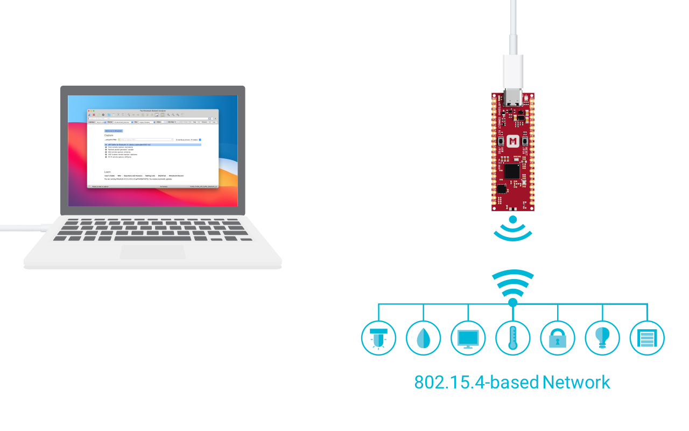
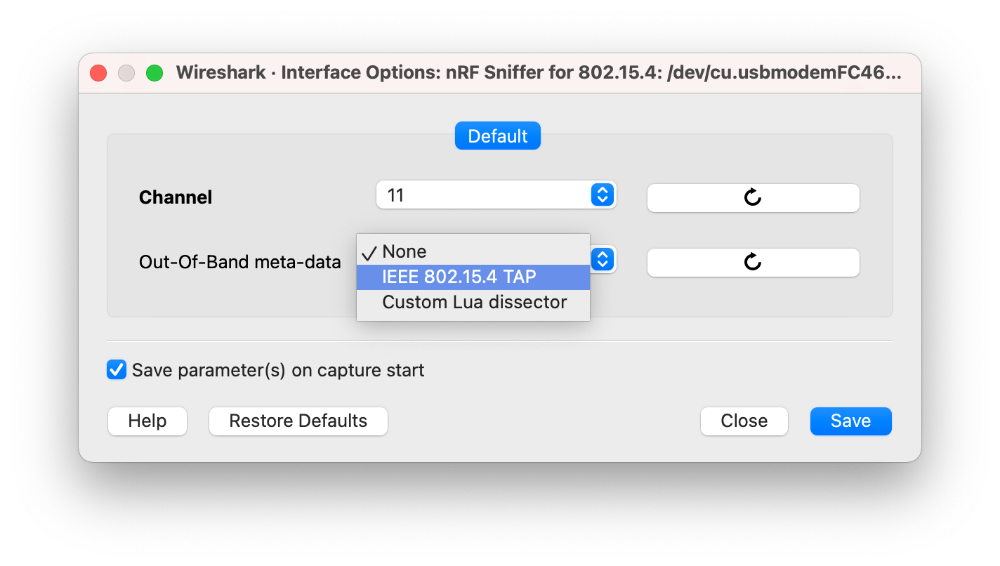

# Capturing data with the nRF Sniffer

You can start capturing manually from Wireshark or using a Python script.

The nRF Sniffer for 802.15.4 listens on the specified channel to pick up as many packets as possible from as many devices as possible. The default channel is _11_. To listen on a different channel, you can either [run nRF Sniffer with custom options](#running-nrf-sniffer-in-wireshark-with-custom-options) (if you are starting the capturing process manually) or set the specific channel when [integrating the nRF Sniffer module into your script](#integrating-nrf-sniffer-python-module-into-a-script) (if you are running the capture from a script).

## Setting up hardware for nRF Sniffer

Before you start sniffing, place the nRF52840 Connect Kit that runs the nRF Sniffer for 802.15.4 firmware near the devices that are communicating. The hardware setup is the same for all supported methods of capturing data, whether Wireshark or a custom Python script.

Connect the nRF52840 Connect Kit to your computer and turn it on. Then place it next to the devices that you want to sniff.



## Capturing data in Wireshark

You can start capture manually from Wireshark with or without the out-of-band metadata. Capturing in Wireshark requires [installing an nRF Sniffer plugin](../installation/#installing-the-nrf-sniffer-capture-plugin-in-wireshark).

### Running nRF Sniffer in Wireshark

To start sniffing, open Wireshark and start recording packets.

When you open Wireshark, the Wireshark main window appears. It includes the Wireshark hardware interfaces connected to the nRF Sniffer.


To start sniffing with the default settings, use one of the following options:

* Double-click on the nRF Sniffer for 802.15.4 hardware interface.
* Select the nRF Sniffer for 802.15.4 hardware interface and click the __Capture packets__ button.

By default, both these options start the capturing process on channel _11_ without capturing the out-of-band metadata. If you want to capture this kind of data or listen on a different channel, [run nRF Sniffer with custom options](#running-nrf-sniffer-in-wireshark-with-custom-options).

Wireshark begins capturing data from the nRF Sniffer for 802.15.4 hardware interface, allowing you to [inspect captured data].

### Running nRF Sniffer in Wireshark with custom options

To start listening on a custom channel and with custom out-of-band metadata settings, run the capturing tool in Wireshark from the Interface Options window.

To start sniffing:

1. In the main window of Wireshark, click :fontawesome-solid-gear: next to the nRF Sniffer for 802.15.4 hardware
interface entry to open the __Interface Options__ menu.

2. In you want to specify the __Channel__ on which the packets are to be captured, use the __Channel__ dropdown menu to select it.

3. If you want to get additional out-of-band metadata, use the __Out-Of-Band meta-data__ drop-down menu
to select __IEEE 802.15.4 TAP__.

    

4. Optionally, you can check the __Save parameter(s) on capture start__ option to save the settings for future captures. Keeping this option unchecked will reset the settings to the default values for the next capture.

5. Click __Start__ to run nRF Sniffer.

Wireshark begins capturing data from the nRF Sniffer for 802.15.4 hardware interface, allowing you to [inspect captured data].

## Capturing data using a script

The nRF Sniffer for 802.15.4 can be used in Python scripts to capture packets into a `pcap` file, which you can then open and inspect in Wireshark. Using this option requires installing the capture plugin as a Python module and then integrating it into your script.

###  Installing the nRF Sniffer Python module

You can install the capture tool as a Python module and use this module programmatically in custom Python scripts. The module exposes an API that allows you to start and stop the capture.

To install the nRF Sniffer Python module, complete the following steps:

1. Open a command window in the `tools/nrf802154_sniffer/` folder.
2. Install the script by typing the following command:

    === "Windows"

        ``` bash linenums="1"
        py -3 -m pip install .
        ```

    === "Linux/macOS"

        ``` bash linenums="1"
        python3 -m pip install .
        ```

Then integrate this module into your custom Python script and use it alongside the nRF Sniffer hardware.

###  Integrating nRF Sniffer Python module into a script

In your script, include the nRF Sniffer Python module and specify the parameters for the API function that starts the capture process. These mandatory and optional parameters define what packets are saved to the pcap file.

To integrate the nRF Sniffer Python module into your script:

1. Open your custom Python script and include the nRF Sniffer module:

    ``` py linenums="1"
    from nrf802154_sniffer import Nrf802154Sniffer
    ```

2. Check the name of the port to which you connected the nRF Sniffer device. The name is used to set the `dev` parameter.

3. Check the number of the channel on which you want to listen for packets. The number is used to set the `channel` parameter.

4. At the point in your script where you want to start the capture process, add the following lines to start
the capture. Use the parameter values from the previous steps. For example:

    ``` py linenums="1"
    sniffer = Nrf802154Sniffer()
    sniffer.extcap_capture(fifo="file.pcap", dev="/dev/ttyACM3", channel=26)
    ```

    In this code, the nRF Sniffer script captures packets from the sniffer on port `/dev/ttyACM3` on the channel `26` and saves the results to the `file.pcap` file.

    See the following table for the description of all parameters of the `extcap_capture()` function and their possible values.

    | Parameter   | Type      | Description |
    |-------------|-----------|-------------|
    | fifo        | Mandatory | Defines the name of the pcap file to which the captured packets will be saved. The parameter value can also include the path to the file directory if you want to save it in a custom directory. By default, the script saves the file in the working directory. |
    | dev         | Mandatory | Defines the serial port used to communicate with the nRF Sniffer hardware. |
    | channel     | Mandatory | Specifies the 802.15.4 radio channel number on which the nRF Sniffer listens for packets. |
    | metadata    | Optional  | Specifies the metadata type for the packet capture. Use `ieee802154-tap`. |
    | control_in  | Unused    | Specifies a file that Wireshark is going to use to control the capture plugin during run time. Currently unused. |
    | control_out | Unused    | Specifies a file that Wireshark is going to use to control the capture plugin during run time. Currently unused. |

5. At the point in your script where you want to stop the capture process, add the following lines:

    ``` py linenums="1"
    sniffer.stop_sig_handler()
    ```

    !!! Note 
        You can add the lines that start and stop the script multiple times in your script. Make sure to stop the capture before you start a new capture process.

When you run the script with the nRF Sniffer hardware, the nRF Sniffer captures packets and saves the results into the `pcap` file. Open this file in Wireshark to [inspect captured data].


[inspect captured data]: ./inspecting-data.md
