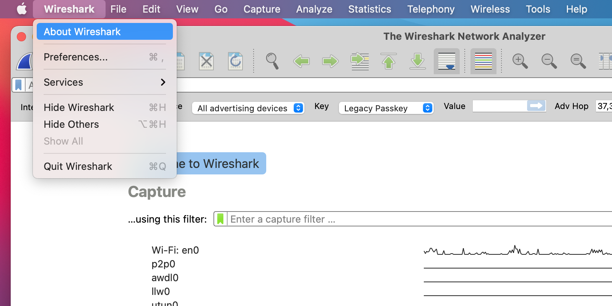
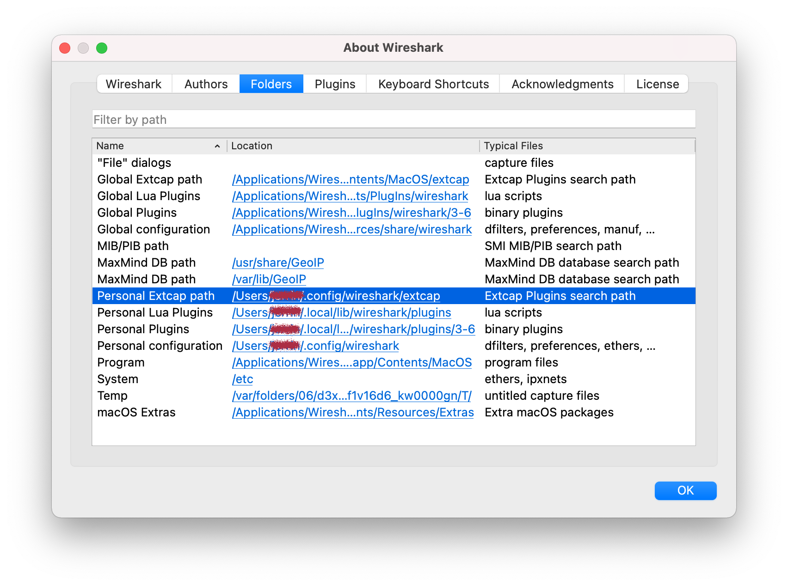

# Installing nRF Sniffer for 802.15.4

The nRF Sniffer for 802.15.4 consists of firmware that is programmed onto a nRF52840 Connect Kit and a capture plugin for [Wireshark] that records and analyzes the detected data.


## Programming the nRF Sniffer firmware

You must connect a nRF52840 Connect Kit running the nRF Sniffer firmware to your computer to be able to use the nRF Sniffer for 802.15.4.

The nRF Sniffer firmware in `.uf2`-format is located in [`firmware/nrf802154_sniffer/`](https://github.com/makerdiary/nrf52840-connectkit/tree/main/firmware/nrf802154_sniffer).

Download the latest firmware and complete the following steps to flash the firmware:

1. Push and hold the __USER__ button and plug your board into the USB port of your computer. Release the __USER__ button after your board is connected. The RGB LED turns green.

2. It will mount as a Mass Storage Device called __UF2BOOT__.

3. Drag and drop `nrf802154_sniffer_<version>.uf2` onto the __UF2BOOT__ volume. The RGB LED blinks red fast during flashing.

4. Reset the board and the nRF Sniffer will start running.

## Installing Wireshark

To install Wireshark for your operating system, complete the following steps:

=== "Windows/macOS"

    1. Go to the [Wireshark download page].
    2. Click the release package for your operating system from the __Stable Release__ list. The download starts automatically.
    3. Install the package.

=== "Ubuntu Linux"
    1. Download the Wireshark standard package or the latest stable PPA for Ubuntu Linux distribution from the [Wireshark download page].
    2. Install the package on your computer.
    3. Answer `yes` when the installer asks you if non-superusers should be able to capture packets. This ensures that packet capture is available to all users in the _wireshark_ system group.
    4. Add the correct user to the _wireshark_ user group. For example, type `sudo usermod -a -G wireshark $USER`.
    5. Add the correct user to the _dialout_ user group. For example, type `sudo usermod -a -G dialout $USER`.
    6. Restart your computer to apply the new user group settings.

## Installing the nRF Sniffer capture plugin in Wireshark

The nRF Sniffer for 802.15.4 software sends commands to the nRF Sniffer hardware through the serial port and reads the captured frames. The software can be installed as an external capture plugin in Wireshark. You need to install the plugin only if you plan to use the nRF Sniffer as a Wireshark capture interface.

To install the nRF Sniffer capture plugin, complete the following steps:

1. Install the Python requirements:

    1. Open a command window in the `tools/nrf802154_sniffer/` folder.
    2. Install the Python dependencies listed in `requirements.txt` by doing one of the following:

        === "Windows with Python launcher"

            ``` bash linenums="1"
             py -3 -m pip install -r requirements.txt
            ```

        === "Windows without Python launcher"

            ``` bash linenums="1"
            python -m pip install -r requirements.txt
            ```
        
        === "Linux/macOS"

            ``` bash linenums="1"
            python3 -m pip install -r requirements.txt
            ```

    3. Close the command window.

2. Copy the Sniffer capture plugin into Wireshark's folder for external capture plugins:

    1. Open Wireshark.
    2. Go to __Help__ > __About Wireshark__ (on Windows or Linux) or __Wireshark__ > __About Wireshark__ (on macOS).

        
    
    3. Select the __Folders__ tab.
    4. Double-click the location for the __Personal Extcap path__ to open this folder.

        
    
    5. Copy the following files from the `tools/nrf802154_sniffer/nrf802154_sniffer` folder into this folder:

        === "Windows"

            * `nrf802154_sniffer.py`
            * `nrf802154_sniffer.bat`

        === "Linux/macOS"

            * `nrf802154_sniffer.py`
            * `nrf802154_sniffer.sh`

3. Make sure that the nRF Sniffer files run correctly:

    1. Open a command window in Wireshark's folder for personal external capture plugins.
    2. Run the Sniffer tool to list available interfaces.

        === "Windows"

            ``` bash linenums="1"
            nrf802154_sniffer.bat --extcap-interfaces
            ```

        === "Linux/macOS"

            ``` bash linenums="1"
            ./nrf802154_sniffer.sh --extcap-interfaces
            ```

        You should see a series of strings, similar to what is shown in the following:

        ``` { .bash .no-copy linenums="1" }
        extcap {version=0.7.2}{help=https://github.com/NordicSemiconductor/nRF-Sniffer-for-802.15.4}{display=nRF Sniffer for 802.15.4}
        control {number=6}{type=button}{role=logger}{display=Log}{tooltip=Show capture log}
        ```

4. Refresh the interfaces in Wireshark by selecting __Capture__ > __Refresh Interfaces__ or pressing ++f5++.

    You should see that nRF Sniffer for 802.15.4 is displayed as one of the interfaces on the start screen.

    


[Wireshark]: https://www.wireshark.org/
[Wireshark download page]: https://www.wireshark.org/download.html
