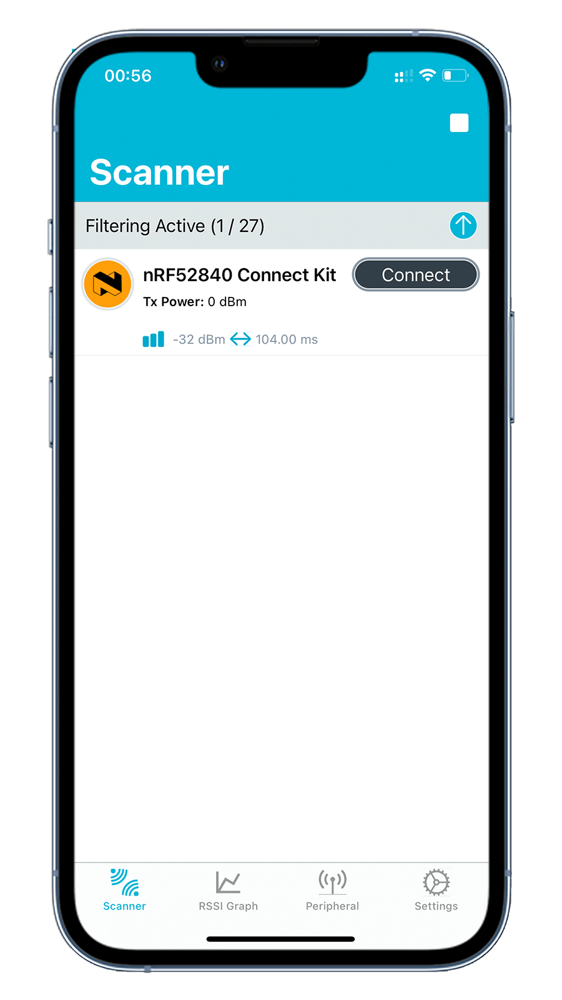

# BLE Advertising

## Overview

The BLE Advertising sample demonstrates the BLE Advertising functionality using the `adafruit_ble` module.

When the code starts, nRF52840 Connect Kit will advertise with its name.

!!! Tip
    `adafruit_ble` is pre-built into [CircuitPython] as a frozen module, so that it can be imported in the code directly.

## Requirements

Before you start, check that you have the required hardware and software:

- [nRF52840 Connect Kit](https://makerdiary.com/products/nrf52840-connectkit) running the [CircuitPython] firmware
- 1x USB-C Cable
- A smartphone or a tablet with [nRF Connect for Mobile] installed
- [Mu Editor]
- A computer running macOS, Linux, or Windows 7 or newer

## Running the code

To run the code, complete the following steps:

1. Connect nRF52840 Connect Kit to your computer using the USB-C Cable.
2. Start Mu Editor, click __Load__ to open `code.py` in the __CIRCUITPY__ drive.
3. Copy and paste the following code into `code.py` and click __Save__:

    ``` python linenums="1" title="CIRCUITPY/code.py"
    from adafruit_ble import BLERadio
    from adafruit_ble.advertising import Advertisement

    ble = BLERadio()
    ble.name = "nRF52840 Connect Kit"
    advertisement = Advertisement()
    advertisement.complete_name = ble.name
    advertisement.connectable = True

    while True:
        print(advertisement)
        ble.start_advertising(advertisement)
        while not ble.connected:
            pass
        print("connected")
        while ble.connected:
            pass
        print("disconnected")
    ```

4. Your code will run as soon as the file is done saving. Start the [nRF Connect for Mobile] app, scan the device and observe that the board is advertising with the Device Name __`nRF52840 Connect Kit`__.

    { width='250' }

[nRF Connect for Mobile]: https://www.nordicsemi.com/Products/Development-tools/nRF-Connect-for-mobile
[Mu Editor]: ../../getting-started.md#coding-with-mu-editor
[CircuitPython]: ../../getting-started.md#installing-circuitpython
