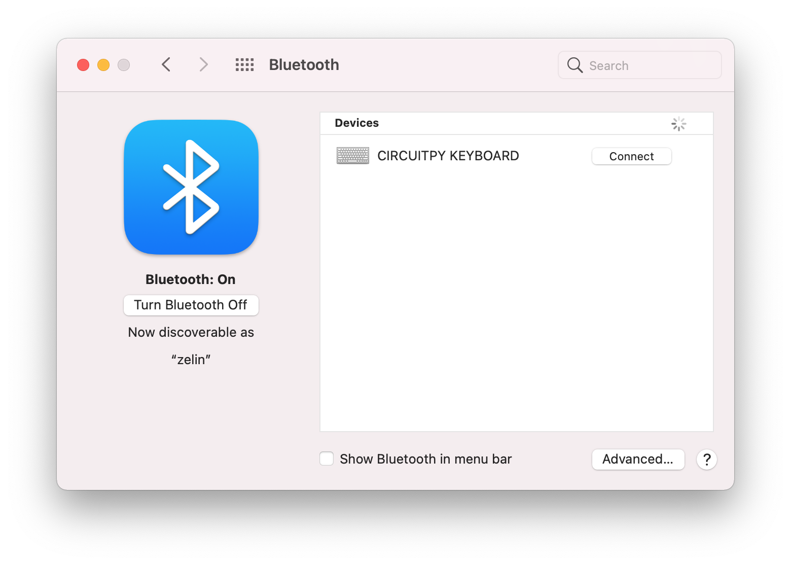

# BLE HID Keyboard

## Overview

The BLE HID Keyboard sample demonstrates how to use the GATT Human Interface Device (HID) Service to implement a keyboard input device that you can connect to your computer.

This sample code enumerates the nRF52840 Connect Kit into a BLE HID keyboard that has an <kbd>A</kbd> key connected to the __USER__ button.

!!! Tip
    `adafruit_ble` and `adafruit_hid` are pre-built into [CircuitPython] as frozen modules, so that they can be imported in the code directly.

## Requirements

Before you start, check that you have the required hardware and software:

- [nRF52840 Connect Kit](https://makerdiary.com/products/nrf52840-connectkit) running the [CircuitPython] firmware
- 1x USB-C Cable
- [Mu Editor]
- A computer running macOS, Linux, or Windows 7 or newer, with Bluetooth LE supported

## Running the code

To run the code, complete the following steps:

1. Connect nRF52840 Connect Kit to your computer using the USB-C Cable.
2. Start Mu Editor, click __Load__ to open `code.py` in the __CIRCUITPY__ drive.
3. Copy and paste the following code into `code.py` and click __Save__:

    ``` python linenums="1" title="CIRCUITPY/code.py"
    import board
    import digitalio

    from adafruit_hid.keyboard import Keyboard
    from adafruit_hid.keyboard_layout_us import KeyboardLayoutUS
    from adafruit_hid.keycode import Keycode

    import adafruit_ble
    from adafruit_ble.advertising import Advertisement
    from adafruit_ble.advertising.standard import ProvideServicesAdvertisement
    from adafruit_ble.services.standard.hid import HIDService
    from adafruit_ble.services.standard.device_info import DeviceInfoService

    # USER button acts as A key on a keyboard
    key_a = digitalio.DigitalInOut(board.USER)
    key_a.direction = digitalio.Direction.INPUT
    key_a.pull = digitalio.Pull.UP

    # LED0 indicates A key is pressed
    led = digitalio.DigitalInOut(board.LED0)
    led.direction = digitalio.Direction.OUTPUT
    led.value = True

    # Use default HID descriptor
    hid = HIDService()
    device_info = DeviceInfoService(
        software_revision=adafruit_ble.__version__, manufacturer="Makerdiary"
    )
    ble = adafruit_ble.BLERadio()
    ble.name = 'CIRCUITPY KEYBOARD'
    advertisement = ProvideServicesAdvertisement(hid)
    advertisement.complete_name = ble.name
    advertisement.appearance = 961
    scan_response = Advertisement()

    if ble.connected:
        for c in ble.connections:
            c.disconnect()

    print("advertising")
    ble.start_advertising(advertisement, scan_response)

    keyboard = Keyboard(hid.devices)

    while True:
        while not ble.connected:
            pass
        while ble.connected:
            if not key_a.value:
                print("Key A pressed!")

                # Turn on LED0
                led.value = False

                while not key_a.value:
                    pass    # Wait for key A released

                # Type keycode `Shift+A`
                keyboard.press(Keycode.SHIFT, Keycode.A)
                keyboard.release_all()

                # Turn off LED0
                led.value = True
        ble.start_advertising(advertisement)

    ```

4. Your code will run as soon as the file is done saving. A Bluetooth keyboard with the name __`CIRCUITPY KEYBOARD`__ can be discovered by your computer. Connect to the keyboard.

    

5. Open a text editor and press __USER__ button on the board. Every button press sends a character __`A`__ to your computer, and this will be displayed in the text editor.

[Mu Editor]: ../../getting-started.md#coding-with-mu-editor
[CircuitPython]: ../../getting-started.md#installing-circuitpython
