# Hardware description

This section of the documentation specifies and describes the nRF52840 Connect Kit mainly from a hardware point of view. 

## Hardware diagram

The following figure illustrates the nRF52840 Connect Kit hardware diagram. The design is available in Chip antenna and U.FL receptacle options, both have most of the same components except the antenna interface.

[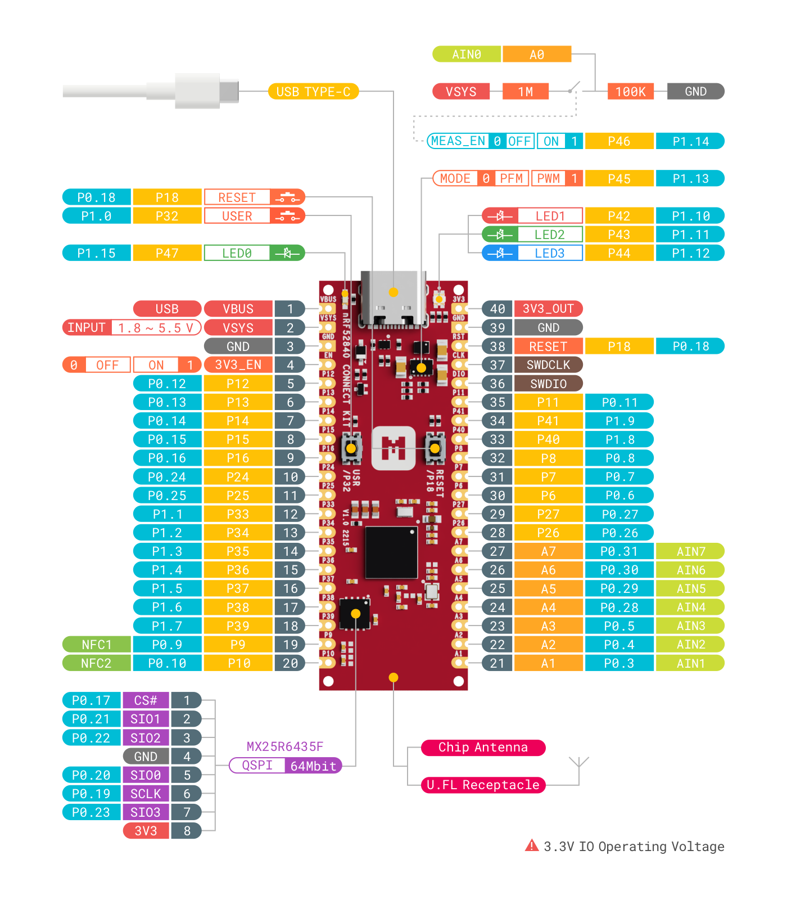](./assets/attachments/nrf52840-connectkit-quick-start-guide.pdf)

## Mechanical dimensions

nRF52840 Connect Kit is a single sided 55.88mm x 20.32mm (2.2" x 0.8") 1mm thick PCB with a USB Type-C port and dual castellated/through-hole pins.

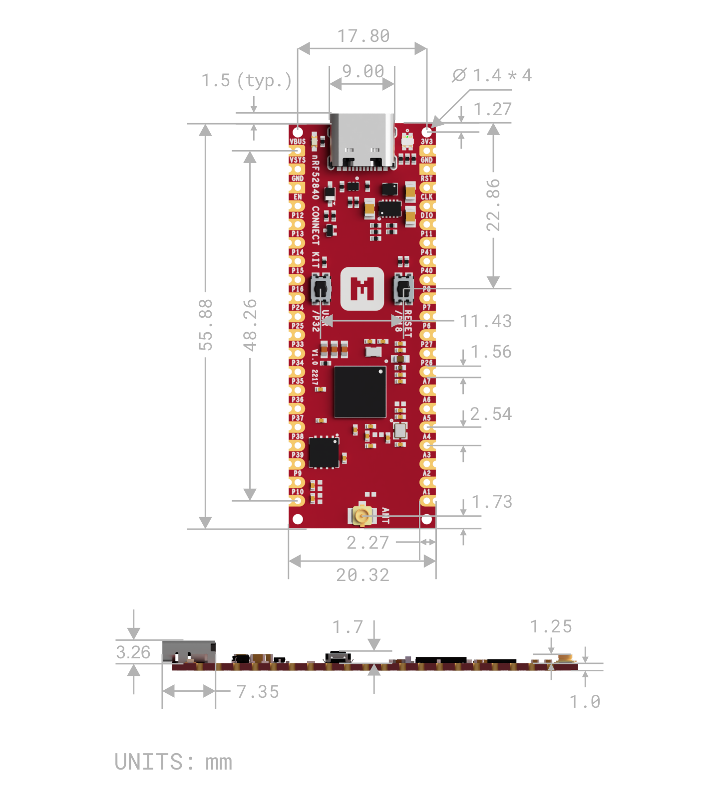

## Power supply

nRF52840 Connect Kit can be powered by either the USB-C port or alternatively __VSYS__ pin with wide input voltage range (1.8-5.5V). An on-board buck-boost converter ([TPS63802]) provides 3V3 to the nRF52840 SoC and all other peripherals.

The following figure illustrates the power supply circuitry:

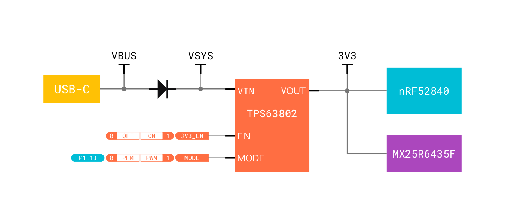

__VBUS__ is the 5V input from the USB-C port. There is a Schottky diode between __VBUS__ and __VSYS__, which adds flexibility by allowing power ORing of different supplies into __VSYS__.

Set __3V3_EN__ __`HIGH`__ to enable __3V3__ output and __`LOW`__ to disable __3V3__ output. This pin has a pull-up resistor (100KOhm) and can be tied to GND to place the board in Power-Down mode.

Set __MODE__ __`LOW`__ for power save mode and __`HIGH`__ for forced PWM mode. This pin is tied to __P1.13__ with a pull-down resistor (100KOhm).

!!! example "How to power the board?"

    nRF52840 Connect Kit has simple and flexible power management with various options for easily powering the board from USB-C, external supplies or batteries.

    === "Using USB-C port"

        This is the simplest way to power the board, which will power __VSYS__ (and therefore the system) from the 5V USB __VBUS__ voltage, through an internal Schottky diode (so __VSYS__ becomes __VBUS__ minus the Schottky diode forward voltage).

        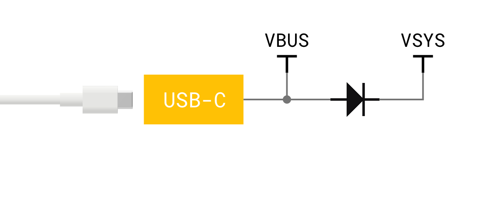

    === "Feeding VSYS directly"

        If the USB-C port is not going to be used, it is safe to power the board by directly connecting __VSYS__ to your preferred power source (in the range 1.8V to 5.5V).

        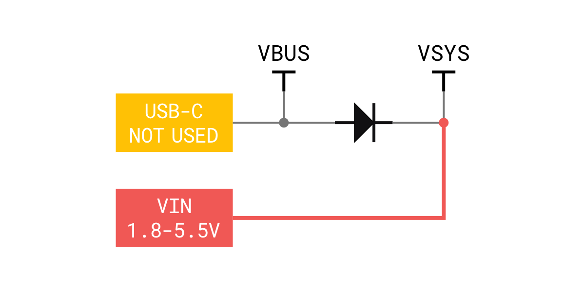

    === "Feeding VSYS via a Schottky diode"

        To safely add a second power source to the board, simply feed __VSYS__ through an external Schottky diode.

        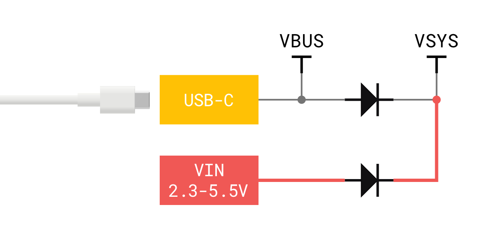

    === "Feeding VSYS via a P-MOSFET"

        An improved way to power from a second source is using an external P-MOSFET to replace the Schottky diode as shown in the following figure.

        

    === "Using a battery charger"

        nRF52840 Connect Kit can be also used with a battery charger with power path manager which will automatically and seamlessly switch between the input source and the battery power.

        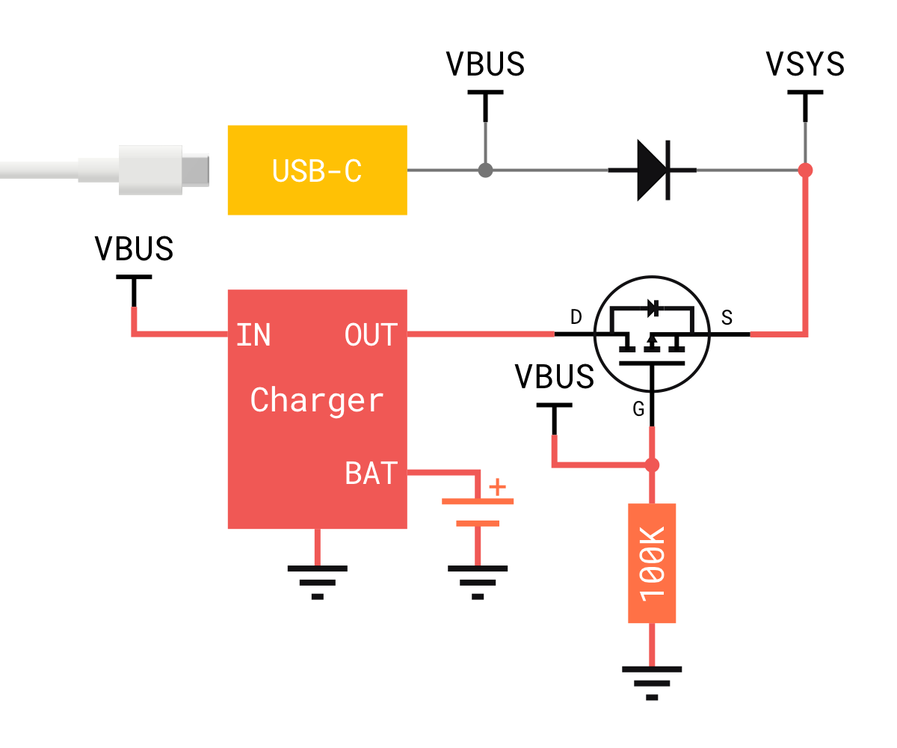
 
## Voltage measurement

nRF52840 Connect Kit uses one ADC input (__AIN0__) and a voltage divider to measure the voltage of __VSYS__. __AIN0__ measures the voltage over the lower resistor and __P1.14__ is used to enable the voltage measurement. The voltage measurement circuitry is shown in the following figure:

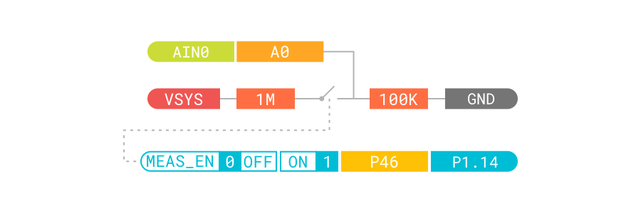

## General purpose I/Os

There are up to 32 multi-function General Purpose I/Os (7 can be used as ADC inputs) available on the header pins. These GPIOs are powered from the on-board 3.3V rail, and should be used for 3.3V logic level. Any GPIO can be mapped to a digital peripheral (such as UART, SPI, TWI, PDM, I2S, QSPI, PWM and QDEC) for layout flexibility.

The following figure illustrates the GPIOs pinout:

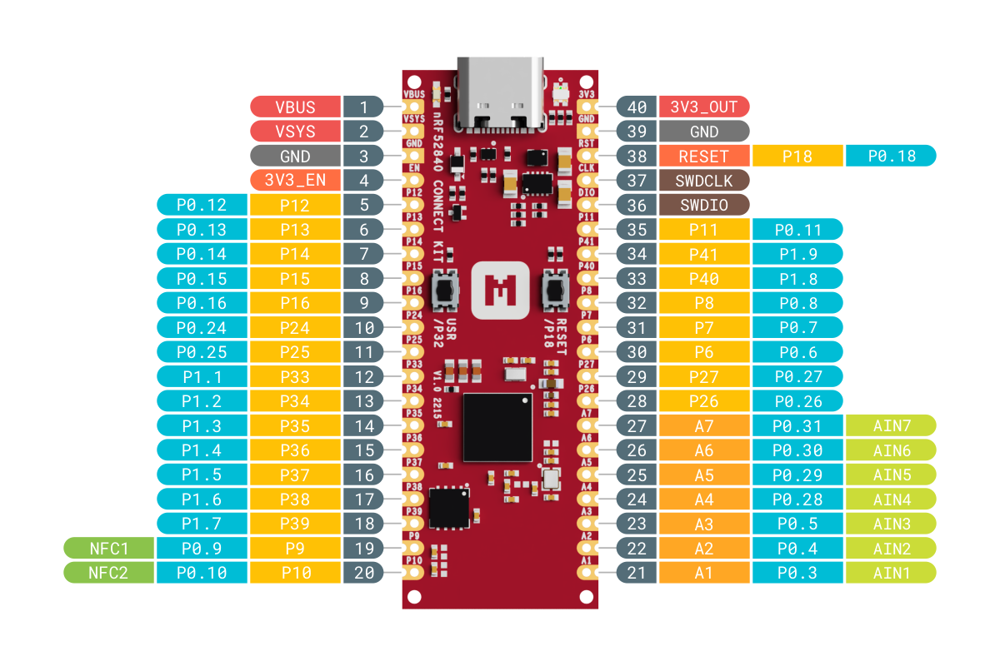

## Buttons and LEDs

There are two buttons, one Green LED and one RGB LED connected to dedicated GPIOs on the nRF52840 SoC. The following table shows the Button and LED connections:

| Part            | GPIO        | Active state |
|-----------------|-------------|--------------|
| USER Button     | __`P1.0`__  | __`LOW`__    |
| RESET Button    | __`P0.18`__ | __`LOW`__    |
| Green LED       | __`P1.15`__ | __`LOW`__    |
| RGB LED - Red   | __`P1.10`__ | __`LOW`__    |
| RGB LED - Green | __`P1.11`__ | __`LOW`__    |
| RGB LED - Blue  | __`P1.12`__ | __`LOW`__    |

## External memory

The nRF52840 SoC has access to an additional 64 Mb of flash memory ([MX25R6435F]) which is a multi-I/O memory supporting both regular Serial Peripheral Interface (SPI) and Quad SPI (QSPI).

The memory is connected to the nRF52840 SoC using the following GPIOs:

| GPIO        | MX25R6435F Pin   |
|-------------|------------------|
| __`P0.17`__ | __`CS#`__        |
| __`P0.19`__ | __`SCLK`__       |
| __`P0.20`__ | __`SIO0/SI`__    |
| __`P0.21`__ | __`SIO1/SO`__    |
| __`P0.22`__ | __`SIO2/WP#`__   |
| __`P0.23`__ | __`SIO3/HOLD#`__ |

## 2.4GHz antenna

nRF52840 Connect Kit has Chip antenna and U.FL receptacle options available to support various applications:

- For most applications, Chip antenna can offer excellent wireless performance.
- For some applications (for example, metallic enclosure or metallized plastic is used), using U.FL receptacle with an external antenna is a better choice, which can offer the best wireless performance.

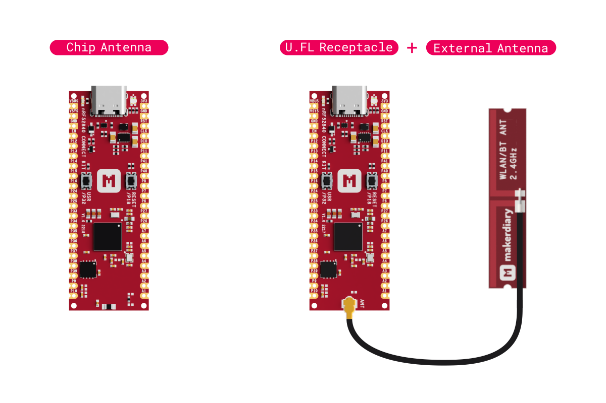

## NFC antenna interface

nRF52840 Connect Kit supports a Near Field Communication (NFC) tag. NFC uses two pins (__NFC1__ and __NFC2__) to connect the antenna. These pins are shared with GPIOs (__P0.09__ and __P0.10__).

An NFC antenna is a coil inductor, and together with capacitors to ground, they form a parallel resonant
LC tank. Since the active device operates at 13.56 MHz, the passive device antenna should also resonate at that frequency. 

The following figure shows the antenna and the parallel capacitors forming an LC tank circuit. The parallel capacitors, C~tune1~ and C~tune2~ are pre-mounted with 100pF capacitors.

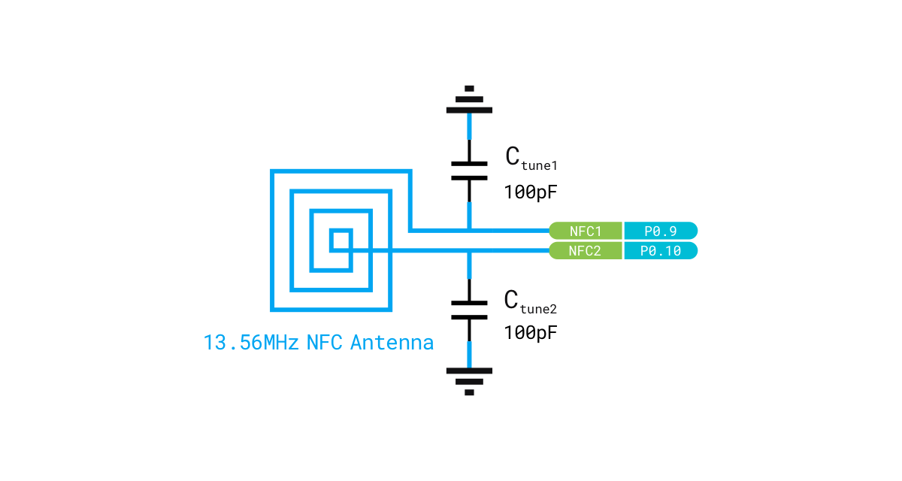

## Debug interface

nRF52840 Connect Kit supports Arm Serial Wire Debug (SWD) port, which makes it possible to connect external debuggers for debugging and programming. The I/O voltage of SWD should be 3.3V.

The following figure demonstrates how to connect an external debugger (for example, [Pitaya-Link debug probe]) for debugging:

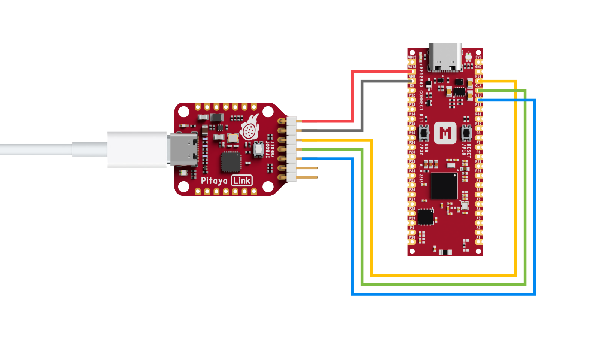

The connections are listed in the table below:

| Pitaya-Link  | Wire                                                      | nRF52840 Connect Kit |
|:------------:|:---------------------------------------------------------:|:--------------------:|
| __`3V3`__    | :fontawesome-solid-arrow-right-long:{ .red-wire }         | __`VSYS`__           |
| __`GND`__    | :fontawesome-solid-arrow-right-long:{ .gray-wire }        | __`GND`__            |
| __`RESET`__  | :fontawesome-solid-arrow-right-long:{ .amber-wire }       | __`RESET`__          |
| __`SWDCLK`__ | :fontawesome-solid-arrow-right-long:{ .light-green-wire } | __`SWDCLK`__         |
| __`SWDIO`__  | :fontawesome-solid-arrows-left-right:{ .light-blue-wire } | __`SWDIO`__          |

[TPS63802]: https://www.ti.com/product/TPS63802
[MX25R6435F]: https://www.mxic.com.tw/en-us/products/NOR-Flash/Serial-NOR-Flash/Pages/spec.aspx?p=MX25R6435F&m=Serial%20NOR%20Flash&n=PM2138
[Pitaya-Link debug probe]: https://makerdiary.com/products/pitaya-link
