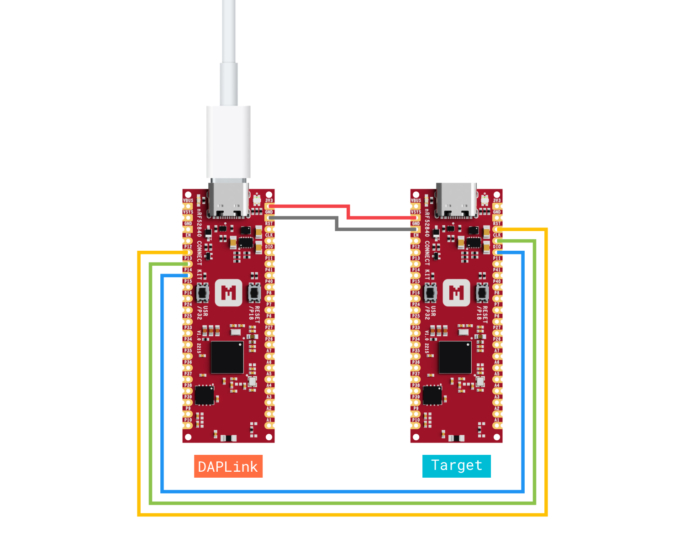

# Using DAPLink Firmware

One nRF52840 Connect Kit can be used to reprogram and debug another, using the DAPLink interface firmware, which creates a bridge between your development computer and the target's debug access port.

## Requirements

Before you start, check that you have the required hardware and software:

- 2x [nRF52840 Connect Kit](https://makerdiary.com/products/nrf52840-connectkit)
- 1x USB-C Cable
- Several jumper wires
- A computer running macOS, Linux, or Windows 7 or newer
- [Python](https://www.python.org/downloads/) 3.6.0 or later
- [pyOCD](https://github.com/pyocd/pyOCD) - Python based tool and API for debugging, programming, and exploring Arm Cortex microcontrollers.

## Programming the DAPLink firmware

You must program the DAPLink firmware onto a nRF52840 Connect Kit to make it become a CMSIS-DAP debug probe. The latest DAPLink firmware is located in the [`firmware/daplink`](https://github.com/makerdiary/nrf52840-connectkit/tree/main/firmware/daplink) folder.

To program the firmware, complete the following steps:

1. Push and hold the __USER__ button and plug your board into the USB port of your computer. Release the __USER__ button after your board is connected. The RGB LED turns green.

2. It will mount as a Mass Storage Device called __UF2BOOT__.

3. Drag and drop the firmware with the name `daplink-nrf52840_connectkit-<version>.uf2` onto the __UF2BOOT__ volume. The RGB LED blinks red fast during flashing.

4. Reset the board, the DAPLink firmware is running and a disk drive called __DAPLINK__ will be automatically detected by the computer.

## Installing pyOCD

The latest stable version of pyOCD may be installed via [pip](https://pip.pypa.io/en/stable/index.html). Open up a terminal and run:

=== "Windows"

    ``` bash linenums="1"
    py -3 -m pip install -U pyocd
    ```

=== "Linux/macOS"

    ``` bash linenums="1"
    python3 -m pip install -U pyocd
    ```

## Wiring the boards

Perform the following steps to connect the boards:

1. Connect the DAPLink board to the target board using the jumper wires.
2. Connect the DAPLink board to the PC using the USB-C Cable.



The following table shows the signals between the DAPLink and the target:

| DAPLink     | Wire                                                      | Target       |
|:-----------:|:---------------------------------------------------------:|:------------:|
| __`3V3`__   | :fontawesome-solid-arrow-right-long:{ .red-wire }         | __`VSYS`__   |
| __`GND`__   | :fontawesome-solid-arrow-right-long:{ .gray-wire }        | __`GND`__    |
| __`P12`__   | :fontawesome-solid-arrow-right-long:{ .amber-wire }       | __`RESET`__  |
| __`P13`__   | :fontawesome-solid-arrow-right-long:{ .light-green-wire } | __`SWDCLK`__ |
| __`P14`__   | :fontawesome-solid-arrows-left-right:{ .light-blue-wire } | __`SWDIO`__  |

## Drag-and-drop programming

Drag-and-drop is an optional intuitive programming feature of DAPLink. It allows programming of your target microcontroller in a very simple way: dragging and dropping a file (`.hex`-format) onto the __DAPLINK__ drive.


## Using pyOCD

The `pyocd` command line tool gives you total control over your device with these subcommands:

- `gdbserver`: GDB remote server allows you to debug using gdb via either the console or [several GUI debugger options](https://pyocd.io/docs/gdb_setup).
- `load`: Program files of various formats into flash or RAM.
- `erase`: Erase part or all of an MCU's flash memory.
- `pack`: Manage [CMSIS Device Family Packs](https://open-cmsis-pack.github.io/Open-CMSIS-Pack-Spec/main/html/index.html) that provide additional target device support.
- `commander`: Interactive REPL control and inspection of the MCU.
- `server`: Share a debug probe with a TCP/IP server.
- `reset`: Hardware or software reset of a device.
- `rtt`: Stream Segger RTT IO with any debug probe.
- `list`: Show connected devices.

You can get additional help by adding `--help` option.

To load/erase the nRF52840 Connect Kit target, open up a terminal and run:

=== "Load `.hex`"

    ``` bash linenums="1"
    pyocd load -t nrf52840 firmware.hex
    ```

=== "Load `.bin`"

    ``` bash linenums="1"
    pyocd load -t nrf52840 --base-address 0x1000 firmware.bin
    ```

=== "Chip Erase"

    ``` bash linenums="1"
    pyocd erase -t nrf52840 --chip
    ```

## Explore further

To learn more about pyOCD, check the [pyOCD Documentation](https://pyocd.io/docs/index).